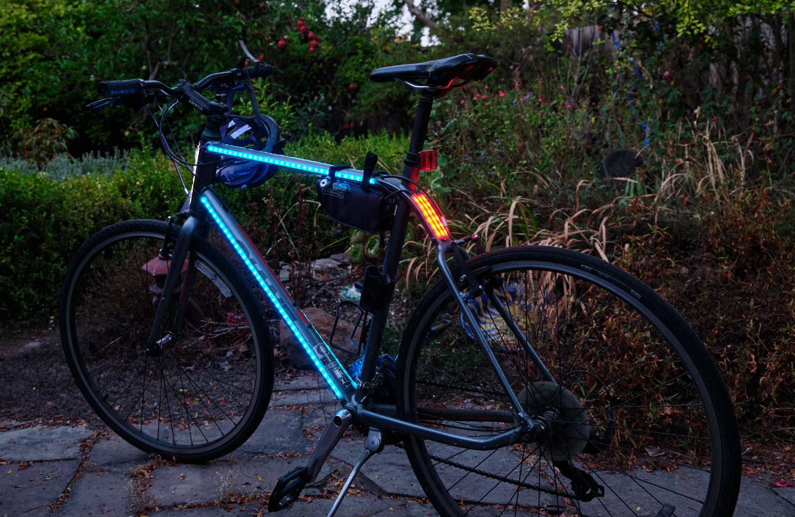
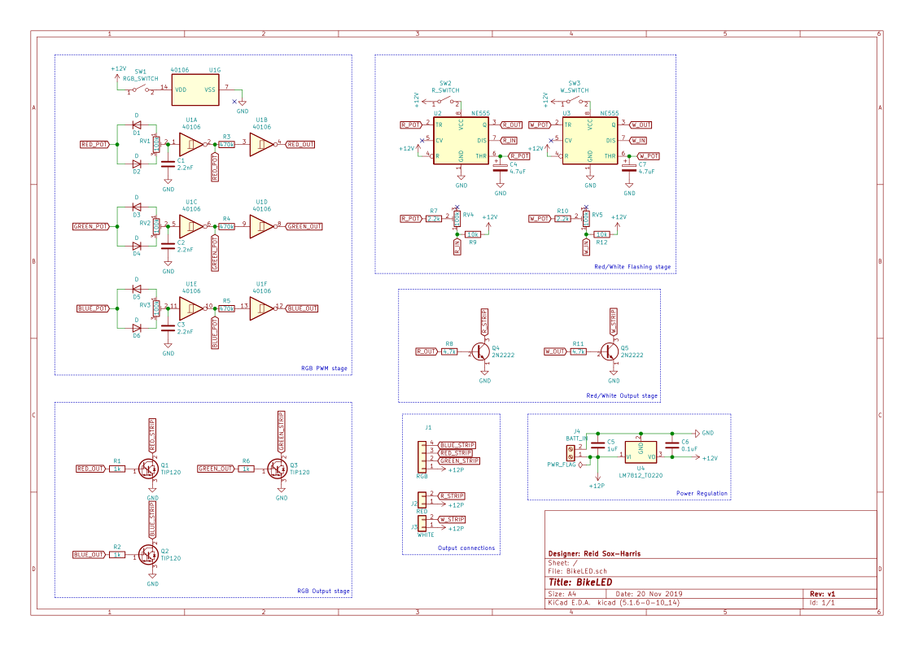
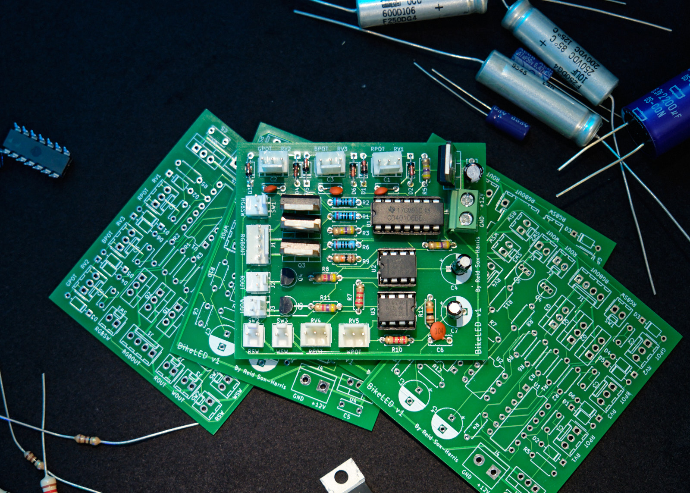
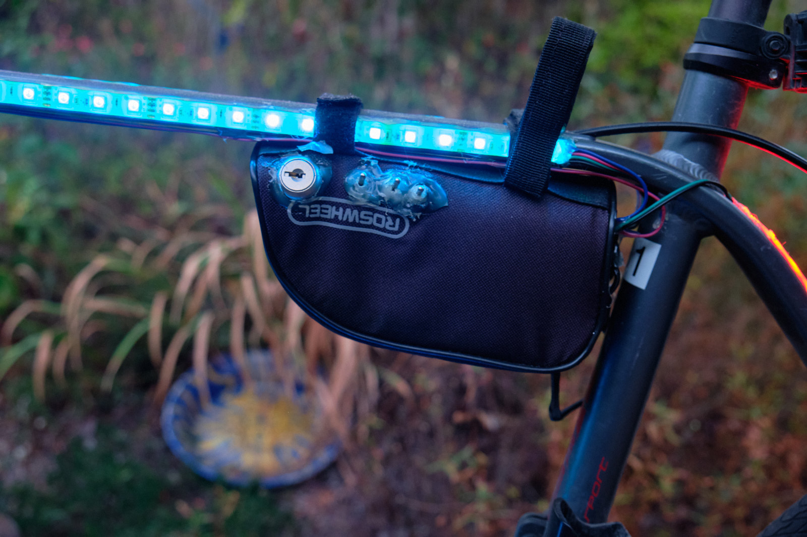
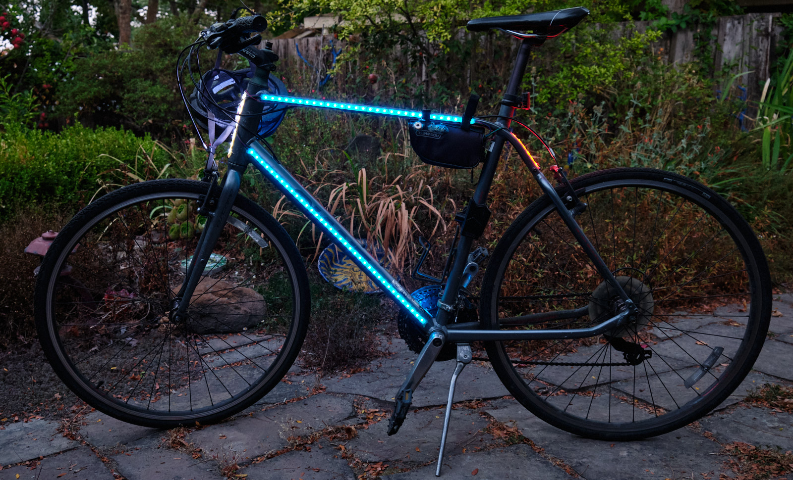
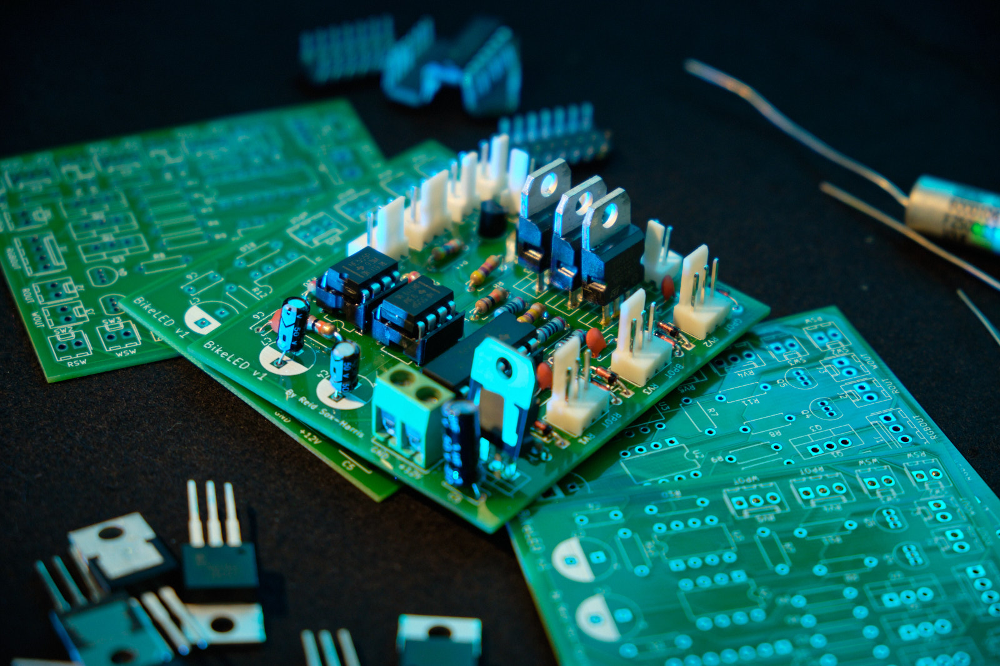

Let's get this out of the way first: 

* Yes, I am aware of modern microcontrollers. 
* Yes, I know digital PWM is a thing. 
* Yes, using microcontrollers would have taken much less time and effort. 

Riding a bike at night is somewhat dangerous. 
In order to be seen by cars, you need to have lights, preferably some that blink, to gain attention. 
With that said, I present to you a bike that cannot not be seen:

To control this spectacle on wheels, I decided to learn something new and do it the old-fashioned way, with analog ICs. 
My requirements were that the front and rear lights needed to flash at independent frequencies, and the frame needed to have full RGB control. 

For the flashing lights, I opted to use the venerable 555 timer, with potentiometers to control the oscillations. 
I was originally going to use the same idea for PWM, but I found that I couldn't get quite the quality I was looking for: there wasn't much usable range before things got less PWM-y and more plain old flashy. 
Thankfully, I discovered the beauty of chained Schmitt triggers, and was able to produce a much cleaner PWM signal using the CD40106, a hex Schmitt trigger that had the exact number of triggers I needed. 

After drawing the schematic in KiCAD, and then transferring it to a board layout, I sent it off to get produced. 
A few weeks later, I received my PCBs and promptly assembled them, made easy by the lack of SMD components. 
I learned my lesson the last time I tried an predominantly SMD board without an oven or even hot air. 
Thanks to rigorous breadboarding and testing, everything worked as expected. 

I threw the PCB into a bike bag along with a voltage regulator, homebrew LiPo battery pack (very hard to make without a spot welder, don't recommend), and all the switches and potentiometers needed to control the lights. 

All in all, this probably took half a year from idea to final product. 
As I said at the beginning, a MCU and some transistors could have probably done the same thing, but in a day. 
But, the extra time and effort was worth it. 
I learned about 555s and Schmitt triggers, and I got to design and manufacture a PCB to implement it all. 

Now, there is no possible excuse drivers can have for not seeing me at night. 

