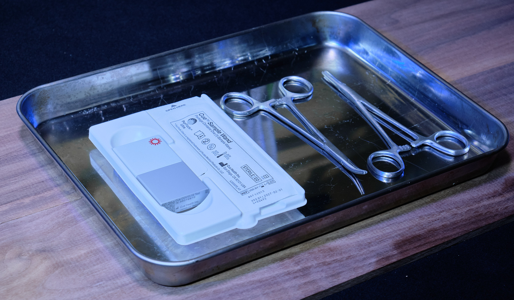
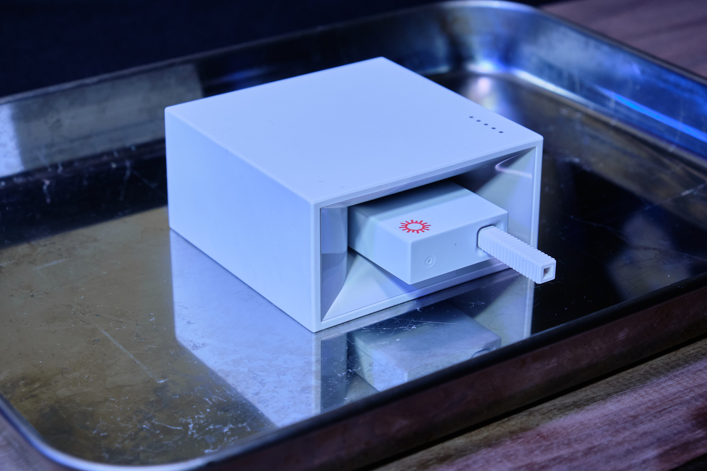
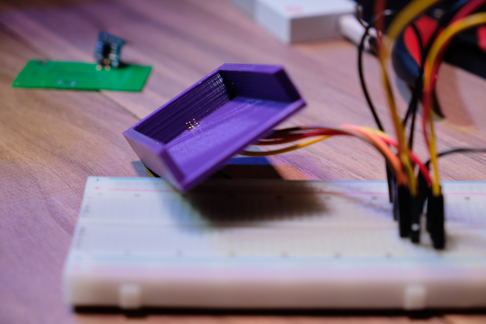
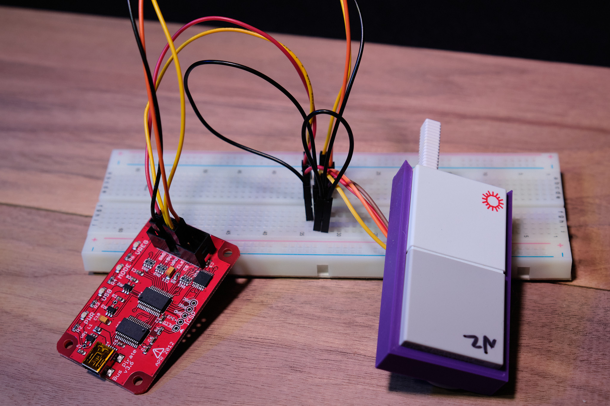

# Background
The [Cue Health test](https://www.cuehealth.com/) is a at-home, PCR COVID test that promises fast, accurate, and portable testing. 
It consists of two parts: a base station (with required app) and a disposable test cartridge. 
You insert the cartridge into the base station, let it warm up, insert your swab, and then wait around 15 minutes for the test to complete. 

While their claims are certainly impressive, my experience has been sub-par. 
To be brief, it gave me a false positive (forcing a few days of quarantine), and then proceeded to give me not one, but two false negatives a few weeks later when I actually got COVID!
Maybe I'm a statistical outlier, maybe my swabbing technique isn't up to par. 
In any case, I've ran enough of these tests to get curious about what is in these $60 disposable cartridges.

# The Cartridge
The first thing that I noticed when I saw these were the sheer number of pins on this thing!
Whatever is happening in here, it must be some pretty advanced tech to require 20 connections to the base station. 
Well, let's tear it apart and see how they managed to cram a chemistry lab into a hunk of plastic.

Ha, nope!
Probably a few quarters worth of electrical components, and a bit more than that in plastics. 
Assembly would cost a bit, what with the medical-grade requirements and the micro-fluidics, but still, they must be making plenty of profit on these. 

I'm not a mechanical engineer, nor a chemical engineer, so I can't speak to the microfluidics used in these tests.
I can, however, take a close look at the PCB. 
A beep test allowed me to get an idea of the (very few) connections on this board. 

Again, nothing terribly fancy. 
A few low-ohm resistors to act as heaters, a button for swab detection, a thermistor to make sure the tip gets hot enough, and a few odd pieces of metal at the tip of the swab. 
I initially had no idea what the metal wings were, but thankfully a [patent filing](https://patents.google.com/patent/US20170043335A1/en) reveals that it is a piezoelectric transducer meant to mix the sample on the swab with the sample reagent.

From that same patent document, it shows that the odd rectangles down the center of the PCB are electrodes that can also measure electrical properties of the solution that is applied to it. 
The idea is that the sample and a heated reagent are mixed using the piezoelectric transducer, and then the electrode and ✨✨ chemistry ✨✨ work together to change the solution into something that can be measured to signal the presence of COVID. 
I'm no chemist, but that's pretty neat!

## The memory
The lone IC on the board was a 4K I2C EEPROM, so I though I'd take a look at that. 
Desoldering it from the PCB and mounting it on a breadboard breakout allowed me to dump the memory using my trusty Bus Pirate. 
At first glance, it's all gibberish -- no identifying markers nor patterns. 
The only pattern I found was the contents of the memory repeating roughly every half-Kbyte or so. 

To understand more, I'll need to collect more data. 
I have plenty of used tests, but I'd rather not have to crack each one open, transfer the IC, and dump it manually.
While I had found a way to open them that didn't involve a rubber mallet and some enthusiasm (just heat it up at the center seam, then give it a good pull), that still takes a fair bit of time.
Time for some tooling!

To make connecting the EEPROM to the Bus Pirate easier, I jumped into Fusion 360 and created a holder with holes cut out for pogo pins on top of the right pins. 
A few iterations of the 3D print later, I was finally able to line the holes up just right for consistent, easy mating. 
This meant I just needed to slide the (intact) cartridge into the holder in order to connect the relevant pins to the Bus Pirate. 
I then wrote a Python script that dumped the contents of the I2C EEPROM using the Bus Pirate's serial interface. 
You can find the script in question [here](https://gist.github.com/eosti/a7acce819051ae0cbb672a307d6d59d5).

With multiple data sources, I was now able to compare the hexdumps and spot any similarities or differences. 
Here's what I've found so far:

| Address Range | Contents                                          |
|:-------------:| ------------------------------------------------- |
| 0x00 - 0x01   | Always 0x00                                       |
| 0x02 - 0x41   | Inconsistent, maybe calibration values?           |
| 0x42          | The 'used' bit, 0x00 for unused, 0x01 for used    |
| 0x4B - 0x4E   | Serial number, unknown encoding                   |
| 0x57 - 0x59   | Lot number, unknown encoding                      |
| 0x5E - 0x63   | Use by date, unknown encoding                     |

I didn't put much time into figuring out what encoding was being used -- based on the constant position within the data, I would guess that some sort of stream cipher is being used. 
Interestingly, the Write Protect pin is held low -- in other words, the EEPROM can be freely written to. 
This is utilized when the cartridge is used: address 0x42 has 0x01 written to it when the cartridge is inserted into the reader, signifying that the cartridge can no longer be used. 
But this also means someone nefarious can change things around a bit. 
I assume that this is a trade-off that the Cue Health engineers made, since they assumed that nobody would be silly enough to crack one open to access the memory.

There have [already been hacks demonstrated](https://techcrunch.com/2022/04/21/cue-health-covid-security-false-results/) that allow attackers to change the results of a Cue test at will. 
That has since been patched with a firmware update to the reader to protect the Bluetooth conversations a bit better. 
The attack vector used there was between the reader and the phone, but what if the cartridge itself could be used to lie to the reader?
I don't think this is a particularly easy vector: either the calibration data could be tampered with, or the signals going to the electrodes could be hijacked. 
Either way, it would require significant work to either break the encryption on the EEPROM data or determine the exact signals that the reader expects from the cartridge for a positive or negative result. 
Regardless of feasibility, it is interesting to see the work that was put into bringing PCR tests into the home.
