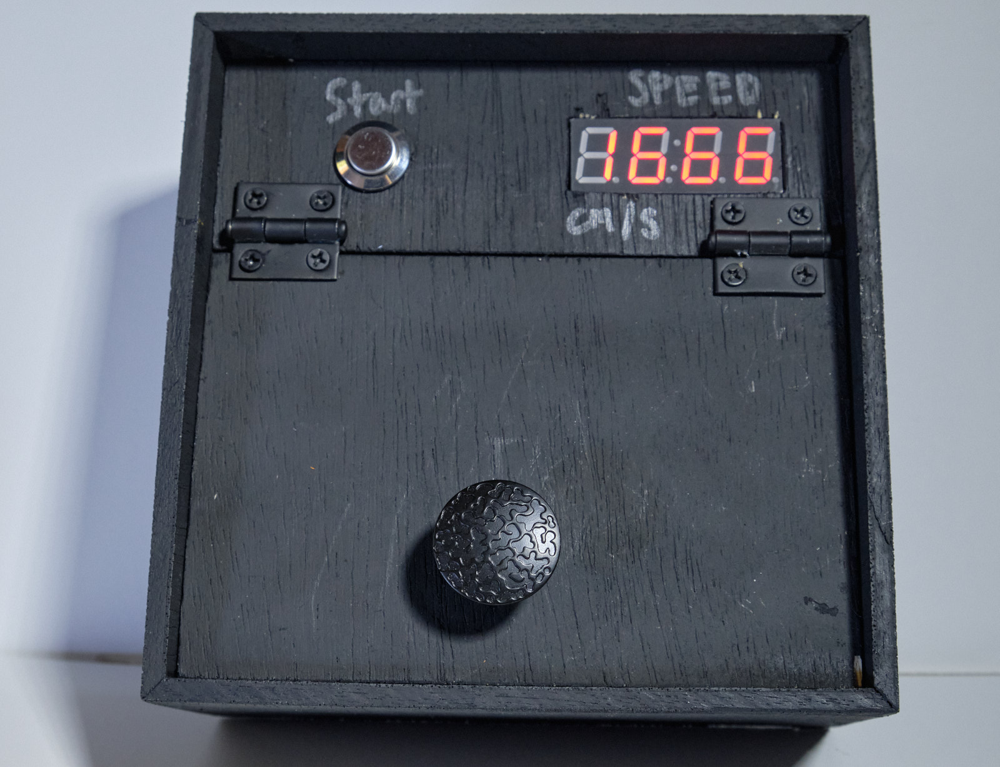
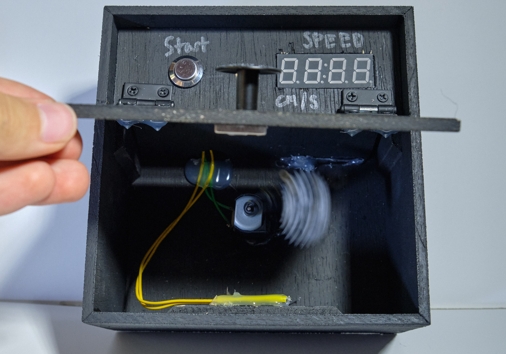

Heisenberg's Uncertainty Principle states only one of two things can be known about a particle at any given time: its velocity or position

This demonstrates that if you can determine the velocity (by looking at the readout) you can't see the particle.
Conversely, if you can see the 'particle' (by opening the box), you no longer can determine the velocity.

In classic form, this project was for an end-of-unit astrophysics project, and completely overkill. I think that it conveys Heisenberg's principle well, but the entire learning a completely new microcontroller architecture in a week or so was a tad extra. 

The brains of this project is a MSP430G2553. This microcontroller is nice and low power, so great for a battery operated project, and also is pretty easy to pick up. I went from "a MSP what?" to this project in about a week. 

The display is a simple TM1637 7-segment display, and the motor is just some cheap hobby motor I found on eBay. Driving that motor is a homebrew H-bridge, thanks to the seller on eEbay picking a _fabulous_ time to not ship me my motor controllers.

The control of the box is simple: the 'start' button is connected to the MSP430's reset pin, so after running the program for a minute or so, it will go into a low-power mode shutdown, with only the reset button able to wake it up. The lid being open or closed is a reed switch and a magnet, not very well hidden at all. I'm blaming the yellow on a short time frame to get this done. 

Side note, the handle that I used is actually the cheapest one that you can get from Home Depot (at least at the time). Given that, I'm surprised by how nice it looks. 

I'll throw the code up on Github once I make it look marginally better.
