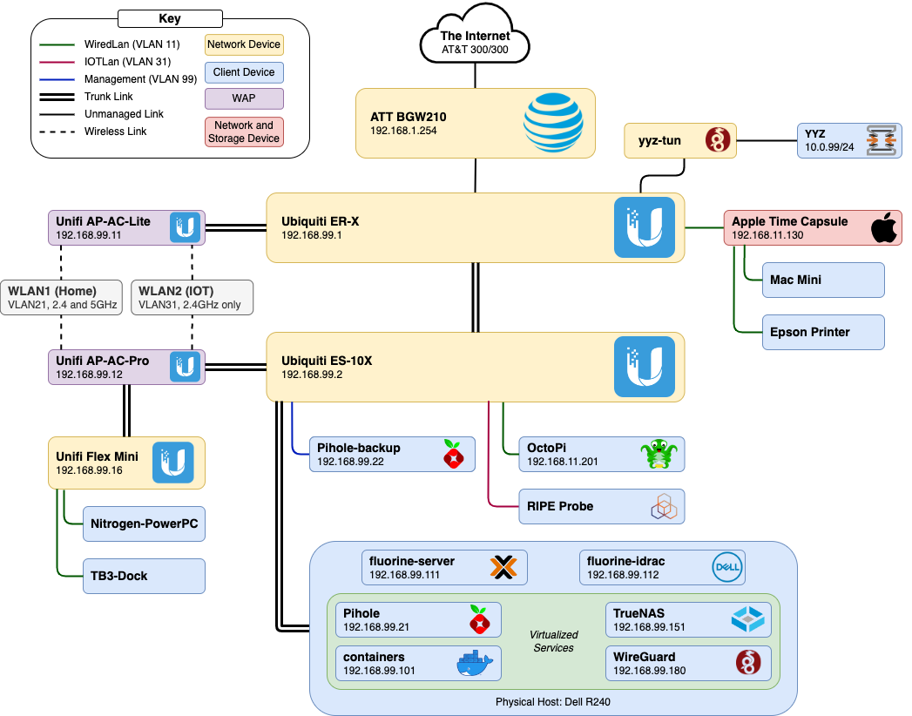
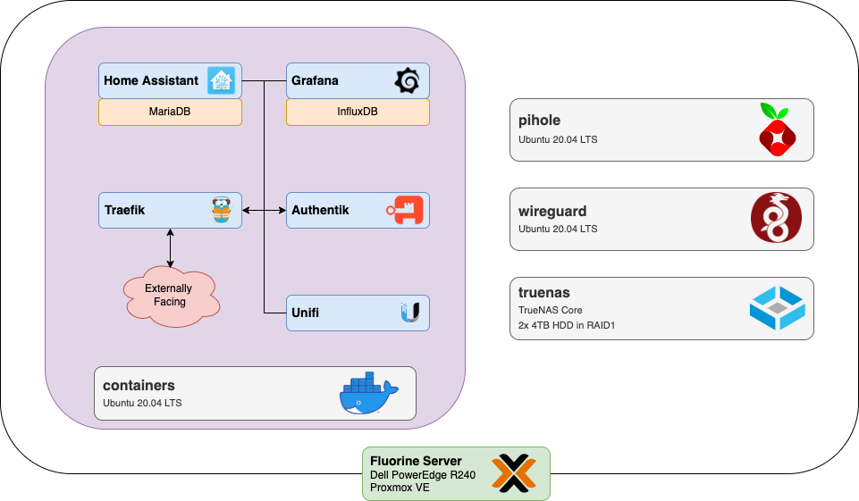

I've always believed that the best way to learn how to do something is by just throwing yourself into it and doing it yourself.
Sure, learning about routing from a book is useful, but that never really sets in until you've accidentally made a routing loop, causing the entire network to crash and then needing to reset the network while the other members of the household are impatiently waiting for the WiFi to come back up.

Not that I've ever done that, of course.

## Network Map ##

Was the ISP-provided router *probably* enough?
Yes.
Is it way more fun to have a fully-fledged segmented wired network with multiple WAPs?
Oh yeah. 

I went with Ubiquiti gear for this network since they offer inexpensive commercial-grade equipment in many shapes and sizes.
Originally, I was using old Cisco and Dell switches, but after I came to terms with the fact that no, I'll never need 48 PoE ports and full L3 switching, I simplified and condensed to compact routers and switches from Ubiquiti.
The power bill thanked me for this move; that Cisco switch was guzzling over 100W even at idle. 

While I was refactoring the network, I decided that I really needed a bunch of VLANS.
I don't actually think that they're necessary here, nor make my network more secure or less busy; I really only added them for the fun of it, to see what I could do with them.

There are four VLANs: management, wired devices, wireless devices, and IoT. 
The IoT VLAN is completely isolated except for a few holes to allow for MQTT and Sonos devices to talk to the server.
The rest just segregate the network nicely, and for the most part, are transparent to whatever I'm working on. 

[Pi-hole](https://pi-hole.net/) is used as a network-wide adblocker and local DNS service. 
The ER-X gently suggests via DHCP and firewall rules that devices should use Pi-hole as their main DNS, so most devices connected to the network have some level of ad blocking.
There is one physical Pi (the OG Model B) as a backup, but I have the main instance virtualised on my main server.

The [Ripe Atlas](https://atlas.ripe.net/) is a tiny little device that RIPE NCC uses to make worldwide network measurements. 
Besides being an easy way to contribute to the health of Internet, it also acts as a canary.
The NCC will send you an email when the probe, and therefore your internet, goes down.
There's usually not much you can actually do when the internet goes down except from get put on hold by your ISP, but it's still nice to know. 
You can apply to get one for free on their [site](https://atlas.ripe.net/get-involved/become-a-host/).

## fluorine-server ##

Virtualise all the things!
Instead of running my services on bare metal, I wanted to play around with VMs and hypervisors a bit, so I installed [Proxmox VE](https://www.proxmox.com/en/proxmox-ve). 
There are four main VMs: one for PiHole, one for a Wireguard VPN server, one for Docker, and one for TrueNAS. 
All of them are running Ubuntu 20.04 LTS, except for [TrueNAS](https://www.truenas.com/) which is an OS specifically for managing drives in a NAS. 

The physical host is a Dell PowerEdge R240 that I got for quite a nice price, and can handle my rather light demands with ease. 
I have an Intel datacenter-grade SSD for VM storage, and a pair of 4TB drives in RAID1 that TrueNAS handles for mass storage. 

While I have dedicated VMs for a few services, I use [Docker](https://www.docker.com/) (and specifically [docker-compose](https://docs.docker.com/compose/)) for managing most of the smaller services, resulting in easy configuration, management, updating, etc.
By storing all the configuration and user data outside of the container, I can easily back up and restore all containers via [BorgBackup](https://www.borgbackup.org/).

All of the sensor data from Home Assistant and my [weatherstation](../weatherstation) gets stored temporarily in a [MariaDB](https://mariadb.org/) instance, but for long term storage, I have a [InfluxDB](https://www.influxdata.com/) container as a single source for all data logging I can think of. 
To make everything more palatable, I use [Grafana](https://grafana.com/) to visualize the data, along with data from [Telegraf](https://www.influxdata.com/time-series-platform/telegraf/). 

Finally, I am using [Traefik](https://traefik.io/traefik/) to tie it all together though a reverse proxy.
Everything is secured through [Authentik](https://goauthentik.io/), an all-in-one identity provider. 

Initial setup and large-scale management is provided by [Ansible](https://www.ansible.com/) and a number of playbooks that I've developed in the process of bringing this all up. 
Why do things manually when you can spend three times as long to automate it?

## Networking, Part 2 ##

But wait, there's more!

As I bounce around the continent during university, I want a reliable connection back to my main server. 
Wherever else I reside, I use a tiny little Dell 7050 Micro as a portable server. 
Once again running Proxmox, it offers similar services as fluorine-server, such as Home Assistant and PiHole. 

However, it also has a VM running [OPNSense](https://opnsense.org/), a fully-featured firewall and routing service. 
Using WireGuard, I create a VPN tunnel between sites, so I can access fluorine-server and all other devices as if they were right next to me on the other side of the continent. 
I wrote up a guide on how to do this [here](opnsense-wireguard-tun), since it involved some more complex routing and configuration than I was expecting.

This means that I can upload Home Assistant data back to the single InfluxDB instance on fluorine-server, but still keep all essential services local in case, say, [Rogers' entire network goes down](https://blog.cloudflare.com/cloudflares-view-of-the-rogers-communications-outage-in-canada/).
I can also use this VPN tunnel to access my desktop computer while I'm out of the house, letting me use the power of a desktop computer for CAD or computation tasks while remote on a laptop. 

I can safely say that many aspects of my homelab are way overkill, and I'm making far more work for myself than it's worth. 
There are many services (VPN, Home Assistant, etc) that have potentially much simpler solutions, but they might be cloud-based, closed-source, or just plain worse than the self-hosted alternative. 
Besides, I've learned so much about how servers and the internet work, as well as picking up many tips and tricks along the way that I've been able to apply outside of a homelab environment. 
To me, that alone is worth it, and the useful services that come along with that are just a nice bonus.
