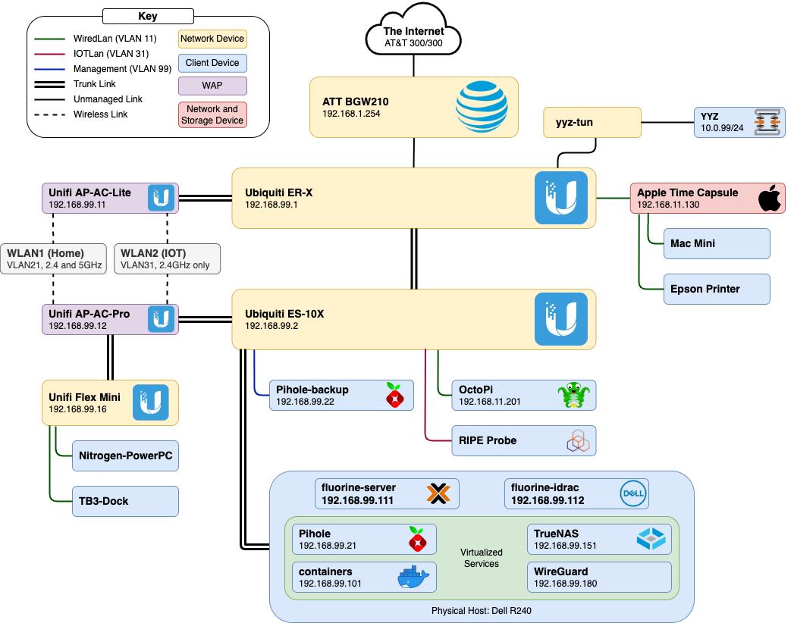

I've always believed that the best way to learn how to do something is by just throwing yourself into it and doing it yourself.
Sure, learning about routing from a book is useful, but that never really sets in until you've accidentally made a routing loop, causing the entire network to crash and then needing to reset the network while the other members of the household are impatiently waiting for the WiFi to come back up.

Not that I've ever done that, of course.

## Network Map ##

Was the ISP-provided router *probably* enough?
Yes.
Is it way more fun to have a fully-fledged wired network with multiple WAPs?
Oh yeah. 

I went with Ubiquiti gear for this network since they offer inexpensive commercial-grade equipment in many shapes and sizes.
Originally, I was using old Cisco and Dell switches, but after I came to terms with the fact that no, I'll never need 48 PoE ports and full L3 routing, I simplified and condensed to compact routers and switches from Ubiquiti.
The power bill thanked me for this move; that Cisco switch was guzzling over 100W even at idle. 

While I was refactoring the network, I decided that I really needed a bunch of VLANS.
I don't actually think that they're necessary here, nor make my network more secure or less busy; I really only added them for the fun of it, to see what I could do with them.

There are four VLANS: management, wired devices, wireless devices, and IoT. 
The IoT VLAN is completely isolated except for a few holes to allow for MQTT and Sonos devices to talk to the server.
The rest just segregate the network nicely, and for the most part, are transparent to whatever I'm working on. 

[Pi-hole](https://pi-hole.net/) is used as a network-wide adblocker and local DNS service. 
The ER-X gently suggests via DHCP and firewall rules that devices should use Pi-hole as their main DNS, so most devices connected to the network have some level of ad blocking.

The [Ripe Atlas](https://atlas.ripe.net/) is a tiny little device that RIPE NCC uses to make worldwide network measurements. 
Besides being an easy way to contribute to the health of Internet, it also acts as a canary, since the NCC will send you an email when the probe, and therefore your internet, goes down.
You can apply to get one for free on their [site](https://atlas.ripe.net/get-involved/become-a-host/).

## lithium-server.lan ##

The pièce de résistance of the entire network, a 2009 Mac Mini that was underpowered even when it was brand new. 
Perfect for a headless install of Ubuntu Server and a handful of applications, though!

[Docker](https://www.docker.com/) (and specifically [docker-compose](https://docs.docker.com/compose/)) manages most of the services, resulting in easy configuration, management, updating, etc.
All user data is stored off of the container and backed up using [BorgBackup](https://www.borgbackup.org/), meaning that very little actually needs to be backed up, as the containers are disposable.

The [Unifi Controller](https://hub.docker.com/r/linuxserver/unifi-controller) keeps an eye on the WAPs and allows for quick and easy configuration.
Unfortunately, the routing and switching gear is (mostly) Edge-line equipment, so this only manages the wireless side. 
The router and the switch can only be configured via their own web-based GUI or CLI.

[HomeAssistant](https://www.home-assistant.io/) is used for a few smarthome-type things.
The main automation is to have my WiZ smartlights change color temperature though the day using [adaptive-lighting](https://github.com/basnijholt/adaptive-lighting).
[Mosquitto](https://hub.docker.com/_/eclipse-mosquitto) is my MQTT broker of choice, communicating with a smart switch and my [weatherstation](../weatherstation).

I use [JellyFin](https://jellyfin.org/) for the occasional video streaming need, and [node-sonos-http-api](https://github.com/jishi/node-sonos-http-api) for the backend to my [Sonos remote](https://github.com/eosti/sonos-remote).

Finally, I am using [Traefik](https://traefik.io/traefik/) to tie it all together though a remote proxy.
Originally I could just remember the port numbers for each service, but that gets hard once you have more than a few services all at once.
Many hours of pain and suffering later, each frequently used service has a sub-domain that is much easier to use.
Theoretically, Traefik is essentially plug-and-play, but HomeAssistant and Unifi both have some networking and encryption requirements that confuse Traefik, so it took a while to get all sorted out.

Having a homelab is great for tinkering around with networking and server management, and I've gotten a lot out of it!
