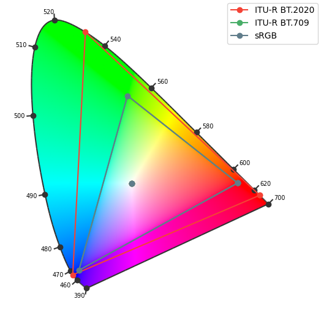
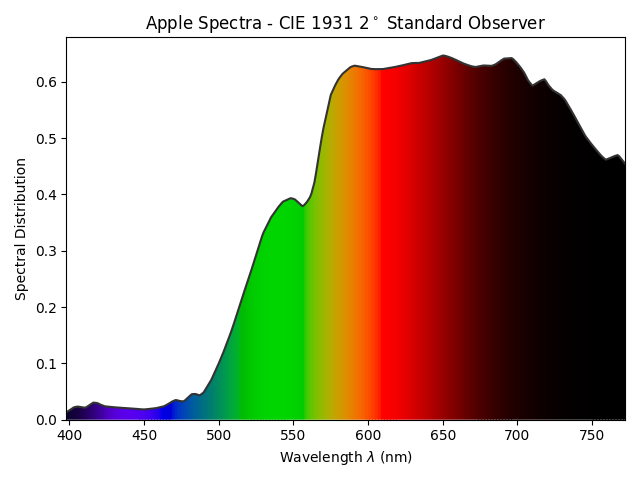
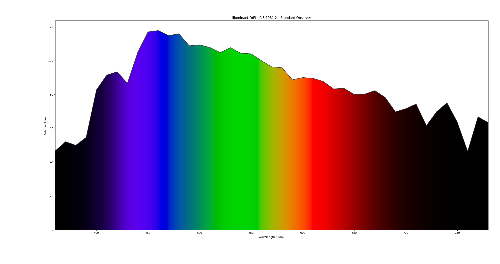
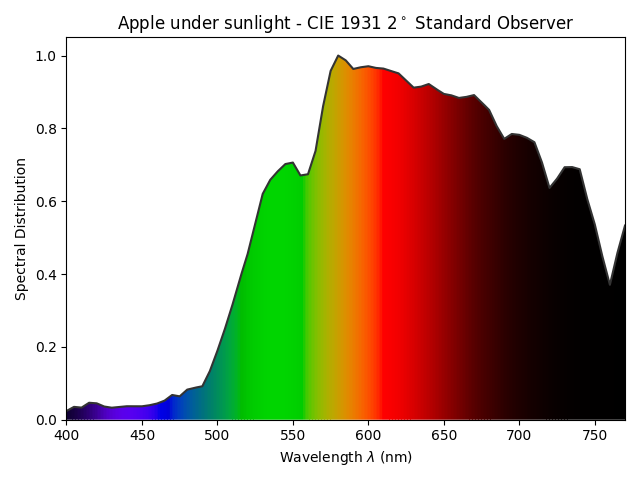
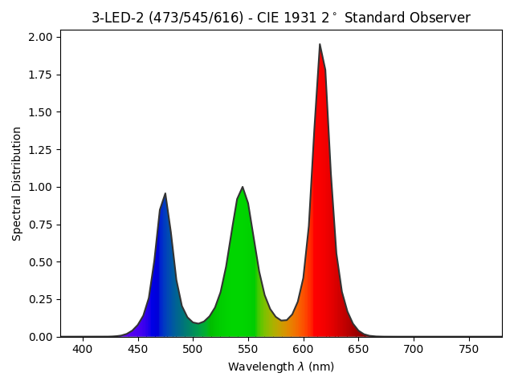
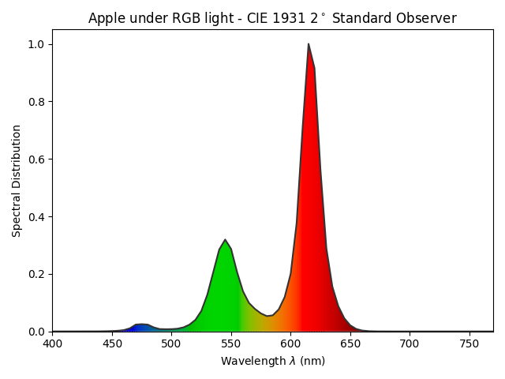
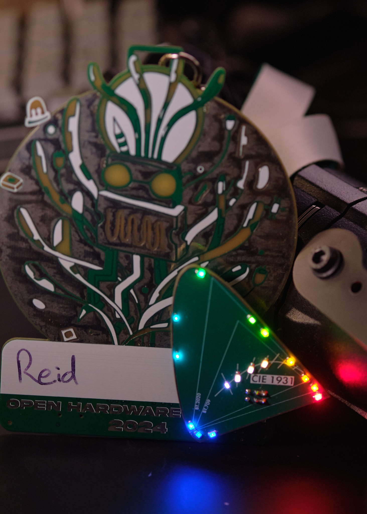

_Note: this page contains the color science and application bits of this design. For the technical build log, check out the [hackaday.io project page](https://hackaday.io/project/198439-metamer-sao)_. 
_Also, still a bit under construction. More plots and better descriptions to come soon._

# Motivation
I do a [fair bit](../../lighting) of theatrical lighting, where color is a significant part of any design. 
You say "blue", I say "R60? L201? G925? AP4870?"
There's shades upon shades of every color imaginable, each containing slightly difference nuance and tone and emotion.
Similar to the Pantone colors (begrudgingly?) embraced by graphic and product designers, lighting designers have been working with Rosco, GAM, Lee, and Apollo (RIP) colors for decades[^1]. 
Each company will sell you any color you need (provided it comes from their two-inch thick swatchbook) in the form of a "gel", or a plastic filter designed to go in front of a tungsten light, removing any unwanted wavelengths to get that perfect shade of [Skelton Exotic Sangria](https://us.rosco.com/en/products/filters/r39-skelton-exotic-sangria) you were after. 

On the plus side, seemingly unlimited choice of high-quality, consistent color. 
Ordering a sheet of [L110](https://leefilters.com/colour/110-middle-rose/) and putting it in front of a standard tungsten lighting fixture means you get the same color in any venue, any time, any where.
You can take a show that closed 10 years ago, rebuy those gels, and get the same colors you did 10 years ago, no problem. 

Of course, there are downsides.
A sheet of gel will set you back $11USD or so, and you can only get 6 to 12 lights worth of gel out of a single sheet. 
For a small theatre, no problem, but larger theatres with hundreds of lights will have quite a gel bill each show. 
But the larger problem is a lack of flexibility. 
Once the gel was installed in the light, you were either happy with it, or have to pay electricians for the time required to get to each light and swap out the color, one light at a time. 
Sometimes a color looks great in your head and in a light lab, until it gets on stage with the set painted a certain way or a costume that uses a certain fabric, and then you have to make the decision to either roll with it or order new gel, wait for it to show up, cut it, swap out the color, and cross your fingers this new color looks better. 

Thankfully, we live in the modern age where LEDs exist! 
The monitor you're viewing this on has RGB pixels and can create basically any color of light you could ever want, so why not use this in the theatre?
Get a lighting fixture that has an RGB LED light engine instead of a tungsten one, and then forgo gels entirely -- you get millions of colors out of the RGB engine anyway. 
Saves the cost of gel, and if you don't like the color, then just change it from the control board with no expensive electrician needed. 
What's not to love?

# The Problem
## Gamut
The first issue with using RGB is simply that it's unable to create the rich variety of colors that a tungsten light + gels could produce. 
This is described by the color gamut, or which colors it can produce as a subset of the colors that humans can see:

Everything inside the triangle is mixable with some combination of R, G, and B (for you linear algebra folks, I believe this would be the basis). 
But everything outside is not reachable -- LEDs don't have negative intensity. 
This is deeply unfortunate for theatrical lighting designers, who *love* their saturated colors: you can't get any more "blue" than your blue LED, so a lot of lovely blues, indigos, and purples are out of reach. 
And good luck getting a saturated teal or amber either, those can't be represented with RGB either. 
This might be acceptable for concert lighting where there's a bit less subtle color design going on, but still a drag either way. 

But while annoying, this isn't actually the biggest issue...

## How Light Interacts With Our Eyes
A given surface, whether that's the skin of an actor, the paint on the set, or a mote of dust, will have a certain spectral reflectance which describes how much of any given wavelength will be reflected from it. 
For example, a typical red apple will have much more reflectance in the red wavelengths than the blue[^2]:

In a similar vein, sources of light have a certain output spectra, which describes the output relative power any given wavelength.
The sun has a pretty flat spectra, so it looks white. 
Unfortunately, it's pretty hard to capture the sun and put it in a room, so we model the sun's output using the D65 standard illuminant:

These two spectra are combined to get the resulting spectra that will bounce off of the apple into our eyes:

As you can see, the combined spectra is still distinctly apple-shaped.
Sure, at higher frequencies the red rolls off a bit faster than on the actual apple, but it's close enough that the color will make sense to our eyes. 
Once the combined spectra hits our eyes, the spectral content is processed by the rods and cones (responsible for color vision and night vision respectively).
There are three kinds of cones, short, medium, and long, each being stimulated by a different range of wavelengths[^3].
The amount of stimulus received by each rod is processed by the brain, and you get color! 

Now, here's the catch. 
This example relied on a relatively wideband source of light (the sun), which means that the resulting spectra after reflecting off of the apple is pretty faithful to the apple's true color. 
The source doesn't distort the reflectance spectra very much. 
But what if we try illuminating it with the narrowband light that comes from an LED?

LEDs are naturally narrowband due to the physics of electrons interacting with the semiconductor band gap[^4].
Most RGB LEDs will use three individual LEDs in one package, typically somewhere around 475nm, 540nm, and 610nm:

Now, let's do what we did before and combine the spectra of the RGB LED with the reflectance of the apple and see what happens: 

Ew. 
That's definitely a red thing, but aside from that, we've lost a lot of the data about what this thing is, and our eyes will certainly not see the same "apple" color as before. 
You'll be able to figure it out from the physical shape of the apple, and the tastiness, but the color itself is much less meaningful than before. 

Therein lies the primary problem of using RGB in theatre: it simply does not look good reflected off of things[^5]. 
It makes actors look sick, changes the color of scenic pieces, and overall makes a performance less pleasant to watch. 
But, but, but, the upsides! 
Unlimited color! 
Not having to pay for gels?
Surely, there has to be a compromise[^6]?

# The Solution
Moar LEDs!
The RGB is problematic because each LED is too narrowband and too far apart, resulting in that spiky luminance plot seen before. 
Thankfully, LEDs come in all shapes and sizes and wavelengths, so how about adding a few more LEDs?

If you want to just add one more LED, a lime LED is the move. 
The reasoning behind this is rather interesting, and instead of explaining it myself, you should go check out [Tucker Down's explaination](https://web.archive.org/web/20221130214607/https://tuckerd.info/01/why-lime/), since he has a PhD in this stuff and I most certainly do not. 
Of course, this isn't perfect, so you can keep adding LEDs to get that smooth spectra to better represent what a tungsten source with gels would output.
For example, ETC's new top-of-the-line LED fixtures [uses 8 LEDs](https://www.etcconnect.com/Products/Entertainment-Fixtures/Source-Four-LED-Series-3/Features.aspx) including an exciting new deep red for better skin tones. 

It's with all that in mind that I designed this board: I wanted to demonstrate all the different ways LEDs could work together to create light, and how our eyes play tricks on us all the time!

To one-up ETC, I've gone with 12 unique wavelengths of color plus four different flavors of white. 
The color names I've decided on for acronymization are: deep Red, Red, Amber, Yellow, Lime, Light green, Green, Teal, Tealer, Blue, deep Blue, UV, Warm White, Cool White, Bright White, and Daylight White. 
All of which are individually controllable over its I2C bus for infinite[^7] mixing opportunities and infinite[^7] fun. 

I'm very happy with the board design from a electrical-design perspective, for which I will again encourage checking out the [Hackaday project page](https://hackaday.io/project/198439-metamer-sao) where instead of talking way too much about colors, I talk way too much  about any-angle PCB routing and low-cost PCB design techniques. 
Come find me at a conference and get one of your very own!

# Wait, What's a Metamer?

Oh yeah, I've kinda diverged from that. 
Metamerism is a result of how our eyes process light: as long as the three types of rod are stimulated in the same way, our brain will see the same color. 
An example of this is the screen that you're reading this on right now! 
It's outputing red, green, and blue to mix together and see white. 
You look at the screen and see white, even though as we've been discussing, it's actually three narowband spectra. 

Now go outside and look at the sun (please don't actually do this), also white! 
The sun is very wideband, the opposite of LEDs
So what gives, why do these two whites look the same?

Since our eyes only have three axes of sensitivity (trichromacy), one for each rod, we can't tell between a complex wideband spectra like the sun and a simple narrowband spectra like LEDs. 
In this case, the RGB white and the sun white happen to stimulate the rods in the same way, so to our eyes, they are identical. 
After it reflects off of an object, though, that's what the rest of this page is about. 

So: a metamer is two distinct spectra of light that appear the same to our eyes due to the limit of trichromacy.

# Sources and Further Reading
The plots were generated with the fantastic [Colour Python package](https://www.colour-science.org/). 
The dataset used for the apple spectra came from the [SpectroFood dataset](https://zenodo.org/records/8362947). 
The code I wrote to make the plots is hiding [deep in the portfolio source code](https://github.com/eosti/portfolio/tree/master/src/projects/metamer-sao/python-plots).

I found the textbooks *Principles of Color Technology* by Roy Berns and *The Lighting Handbook* by the Illuminating Engineering Society very very helpful in learning all these concepts. 

Of course, I am not a color scientist, so everything on this page is a best-effort explanation. 
If you do happen to by a color scientist and spot something wrong, please shoot me an email (and even if you don't spot something wrong, I'd still love to talk). 

## Footnotes
[^1]: 1: Just like [Pantone pulled colors from Adobe](https://www.theverge.com/2022/11/1/23434305/adobe-pantone-subscription-announcement-photoshop-illustrator), [Rosco has pulled colors from Eos](https://www.controlbooth.com/threads/rosco-files-suit-against-etc.49859/), the predominant lighting control software for theatre. They [eventually settled](https://www.etcconnect.com/About/News/Rosco-and-ETC-find-common-ground.aspx), but there was a weird year or two where all Rosco colors were referred to as "Common Color" in Eos. 
[^2]: 2: What's with the black portions of the spectral plots? Our human eyes will respond to all of the wavelengths shown in this plot, but your screen can't display them! Why? Perhaps you should re-read the Gamut section one more time. This makes documenting this project rather annoying because I want to show off this 505nm LED that I found that makes a lovely shade of teal... But I can't, because a photo can't represent that color!
[^3]: 3: The rods are commonly referred to by the spectrum that they're responsible for: long, medium, and short map to red, green, and blue. This is a misconception: it would be more appropriate to refer to them as yellow-green, green, and blue, as the long and medium cones overlap A LOT! And besides, they respond to a range of frequencies, it's just that yellow-green/green/blue is where they have their peak sensitivity. Anyway, how do we see red if we don't have a red cone? The brain finds the difference between the long and medium cones and is able to map that difference to the presence of red. Bodies are crazy y'all. 
[^4]: 4: You may ask: well how do white LEDs work? These are actually pretty wideband, but that's due to using a phosphor. You take a blue LED, put a phosphor over it (typically Ce:YAG) which will fluoresce. The blue from the LED and the yellow from the phosphor combine to make white! This can result in very good, accurate white light, typically characterized by the Color Rendition Index (CRI).
[^5]: 5: Key word being *reflected*. Monitors and screens look great because they're not reflecting off of anything, and have a direct path into your rods. But ever seen someone only illuminated by their screen? They look awful!
[^6]: 6: Before RGB LEDs were a thing, there were gel scrollers that allowed you to either scroll through discrete frames of gel, or have three reels of cyan, magenta, and yellow gel in a gradient from clear to fully saturated that you could mix. This helped alleviate the issue, but they were loud, slow, and mechanically finicky. A step in the right direction, but not yet the perfect solution. 
[^7]: 7: The lawyers say I have to say that infinite = 319,626,579,315,078,487,616,775,634,918,212,890,625, or around 320 undecillion. You'll be around for a while if you want to see every color. 
