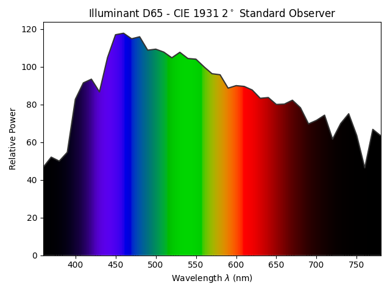

_Note: this page contains the color science and application bits of this design. For the technical build log, check out the [hackaday.io project page](https://hackaday.io/project/198439-metamer-sao)_. 
_Also, still a bit under construction. More plots and better descriptions to come soon._

# Motivation
I do a [fair bit](../../lighting) of theatrical lighting, where color is a significant part of any design. 
You say "blue", I say "R60? L201? G925? AP4870?"
There's shades upon shades of every color imaginable, all 
Similar to the Pantone colors (begrudgingly?) embraced by graphic and product designers, lighting designers have been working with Rosco, GAM, Lee, and Apollo (RIP) colors for decades. 
Each company will sell you any color you need (provided it comes from their two-inch thick swatchbook) in the form of a "gel", or a plastic filter designed to go in front of a tungsten light, removing any unwanted wavelengths to get that perfect shade of [Skelton Exotic Sangria](https://us.rosco.com/en/products/filters/r39-skelton-exotic-sangria) you were after. 

On the plus side, seemingly unlimited choice of high-quality, consistent color. 
Ordering a sheet of [L110](https://leefilters.com/colour/110-middle-rose/) and putting it in front of a standard tungsten lighting fixture means you get the same color in any venue, any time, any where.
You can take a show that closed 10 years ago, rebuy those gels, and get the same colors you did 10 years ago, no problem. 
However, there are downsides.
A sheet of gel will set you back $11USD or so, and you can only get 6 to 12 lights worth of gel out of a single sheet. 
For a small theatre, no problem, but larger theatres with hundreds of lights will have quite a gel bill each show. 
But the larger problem was lack of flexibility. 
Once the gel was installed in the light, you were either happy with it, or have to pay electricians for the time required to get to each light and swap out the color, one light at a time. 
Sometimes a color looks great in your head and in a light lab, until it gets on stage with the set painted a certain way or a costume that uses a certain fabric, and then you have to make the decision to either roll with it or order new gel, wait for it to show up, cut it, swap out the color, and cross your fingers this new color looks better. 

Thankfully, we live in the modern age where LEDs exist! 
The monitor you're viewing this on has RGB pixels and can create basically any color of light you could ever want, so why not use this in the theatre?
Get a lighting fixture that has an RGB light engine instead of a tungsten one, and then forgo gels -- you get millions of colors out of the RGB engine anyway. 
Saves the cost of gel, and if you don't like the color, then just change it from the control board, no expensive electrician needed. 
What's not to love?

# The Problem
## Gamut
One issue with using RGB is simply that it's unable to create the rich variety of colors that a tungsten light + gels could produce. 
This can pretty easily be seen by looking at a standard RGB color gamut (i.e. what colors it can produce)

Everything inside the triangle is mixable with some combination of R, G, and B (for you linear algebra folks, I believe this would be a basis). 
But everything outside is not reachable -- LEDs don't have negative intensity. 
This is deeply unfortunate for theatrical lighting designers, who *love* their saturated colors: you can't get any more "blue" than your blue LED, so a lot of lovely blues, indigos, and purples are simply out of reach. 
Maybe fine for concert lighting where there's a bit less subtle color design going on, but still a drag either way. 

While annoying, this isn't actually the biggest issue...

## Metamerism
## How Eyes Work
Rods and cones! 
Rods sense color, so they're all we care about here. 

## How Light Works
A given surface, whether that's the skin of an actor, the paint on the set, or a mote of dust, will have a certain spectral reflectance which describes how much of any given wavelength will be reflected from it. 

In a similar vein, sources of light have a certain output spectra, which describes the output relative power any given wavelength:

These two spectra are combined to get the resulting "color" spectra that our eyes will see:

![Resulting spectra of aspen lit by the sun]

The resultant spectra is recieved by the rods in the eye, which come in three types: long, medium, and short (sometimes inaccurately referred to as red, green, and blue rods), which have their own response curve that is applied to the incoming light:

![rod spectra]

Finally, the amount of stimulus received by each rod is processed by the brain, and you get color! 
Now, here's the catch. 
This example relied on a relatively wideband source of light (the sun), which means that the resulting spectra after reflecting off of the apple is pretty faithful to the Aspen's true color. 
But what if we try illuminating it with the narrowband light that comes from an LED?

Now, what the eye sees is pretty distorted relative to what the real color from the apple is. 
Will it still look red, yes, but will it also have a weird tinge to it that our eyes will pick up pretty quickly, also yes. 
Therein lies the primary problem of using RGB in theatre: it simply does not look good reflected off of things. 
It makes actors look sick, changes the color of scenic pieces, and overall makes a performance less pleasant to watch. 

#### Aside: how do screens do it?
Easy: don't reflect off of anything. 
Screens emit light that is directly recieved by the eye, no reflecting with confusing objects in between. 
We use RGB to cover a fairly wide gamut of what the eye can see without needing many different types of LEDs. 
Neat!

# The Solution
Moar LEDs!
More LEDs gives a smoother gamut, better representative of what a tungsten source with filters might output. 
For example, ETC's new top-of-the-line LED fixtures [uses 8 LEDs](https://www.etcconnect.com/Products/Entertainment-Fixtures/Source-Four-LED-Series-3/Features.aspx) including an exciting new deep red for better skin tones. 

It's with that in mind that I designed this board: I wanted to demonstrate all the different ways LEDs could work together to create light, and how our eyes play tricks on us all the time!

### Footnote
Just like [Pantone pulled colors from Adobe](https://www.theverge.com/2022/11/1/23434305/adobe-pantone-subscription-announcement-photoshop-illustrator), [Rosco has pulled colors from Eos](https://www.controlbooth.com/threads/rosco-files-suit-against-etc.49859/), the predominant lighting control software for theatre. 
They [eventually settled](https://www.etcconnect.com/About/News/Rosco-and-ETC-find-common-ground.aspx), but there was a weird year or two where all Rosco colors were referred to as "Common Color" in Eos. 

### Spectra Sources
Lumber Specta: https://zenodo.org/records/3269924

D65 and trichromacy: https://www.colour-science.org/
