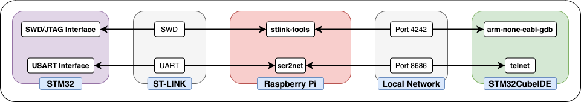

Ever wish you could program your STM32-based project anywhere, at any time?
Well, have I ever got the solution for you!

A Raspberry Pi can be used as a bridge between a local STM32 and a remote client for debugging: 

If the client is using an IDE (such as ST's STM32CubeIDE), a debugging configuration can be set up such that all of the built in tools (uploading, breakpoints, reading registers, etc) are fully functional, as if the ST-Link was connected to your computer.
Otherwise, the Raspberry Pi is running a GDB server, so a remote connection could be made via `arm-none-eabi-gdb`.

The server automatically starts and stops when a ST-Link device is plugged in or removed through `udev` rules.
The server itself is part of the [stlink](https://github.com/stlink-org/stlink) suite of tools. 

Configuration and installation scripts can be found [on GitHub](https://github.com/eosti/remote-stm32).
