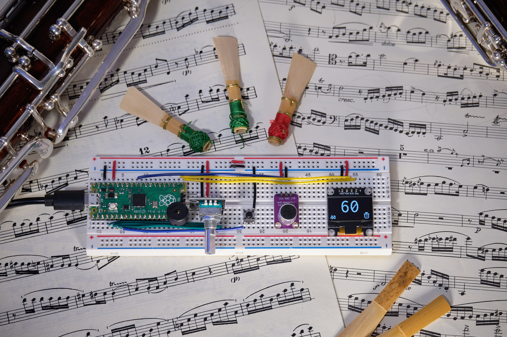

I play the bassoon, a notoriously out-of-tune instrument. 
Every note needs to be played a particular way to play the correct pitch -- one note might always fall a little flat, while the next is consistently 20 percent sharp without adjustments to how you hold the reed in your mouth and how you aim your air. 
As such, I've made best friends with my musical tuner over the years, a reliable source of truth regardless of the temperature, humidity, or temper of the bassoon. 

I learned how to play the bassoon in the States, and later moved to Canada for university. 
The moment I crossed the border, I noticed a change in my playing: all of my notes, sharp or flat, were even more out of tune than usual!
Every time during rehearsal, if I played a note that I thought sounded 7 cents sharp (i.e. 7% closer to the next note than it should be), I would be told that no, I was actually around 10 cents sharp. 
Not a huge difference, but enough to be irritating. 

It took months of experimenting, playing in different environments, trying new reeds, trying to retune my ear, but I finally found the problem. 
As most Canadians know, the US dollar is strong compared to the Canadian dollar, $1.35CAD/USD at time of writing. 
So, in reality, when the conductor was telling me that I was 10 cents sharp, he was of course saying I was 10 *Canadian* cents sharp, or 7 Freedom cents, as I believed. 
Having discovered this, I set out to build a tuner that could do these conversions on the fly, so I could easily discuss tuning with my Canadian counterparts. 

# Signal Processing

A musical tuner doesn't seem that complicated, it's probably just a Fast Fourier Transform (FFT) with peak detection, right?
That really shouldn't take too long; I may as well implement it myself to learn a bit instead of using a library to magically do it for me. 

...wow, that's a lot harder than I expected. 
Turns out, getting a clean signal from a microphone is significantly more tricky than I expected!
Getting the FFT to work right wasn't too tricky. I was able to use the fantastic code (with explanations!) [from V. Hunter Adams](https://vanhunteradams.com/FFT/FFT.html) to get a fairly decent frequency representation from the microphone, though I later added a Hann windowing function to clean it up a bit. 
After that, I quickly learned that simply taking the highest value wasn't sufficient for finding the main note being played, unless you wanted the player to have a minor seizure from the amount of flashing and jumping around that the screen would be doing. 
To overcome this, I started by finding the maxima (yeah, that's just a fancy peak detection still) and then using a low-noise filter to get rid of all the times where there isn't an actual signal. 
Once we're sure there's something to latch onto, I used a three-point quadratic interpolation to really hone in on the actual peak frequency. 

After that, I had to dance a fine line in between getting rid of outliers and making sure the tuner was reactive enough to actual note changes. 
At first, I used a simple rolling average filter that threw out values outside of a few standard deviations of the median, but this didn't allow for changing notes at all -- they just got regarded as outliers!
So, I smashed a few concepts together, and modified the rolling average to save a buffer of outliers, and then if there were a bunch of outliers all of a sudden, assume that the note had changed, dump the current rolling average, and substitute in the so-called "outliers". 
With a bit of parameter tweaking, I was able to achieve good performance: it discards the clearly wrong values while still allowing for fairly quick changing of notes to measure. 

At this point, I had gotten my signal processing chain working, but it was slow and blocked the capture of samples while operating. 
The solution was using the well-documented DMA features present on the RP2040!
The analog-to-digital converter (ADC) that sampled the microphone would fill a FIFO buffer, which would automatically be transferred to a waiting buffer using direct memory transfer (DMA). 
Then, by swapping a "front" and a "back" buffer, I could ensure that no data was lost while the in-place signal processing chain worked its magic. 
The last optimization that I made was using DMA once again to pipeline the conversion of data from the native form (16 bit) to a form that the signal processing chain could use (32-bit, fixed point Q15 format). 

# Other features

To reach feature parity with my trusted [Korg TM-50](https://www.korg.com/caen/products/tuners/tm_50/), I needed to add a few things on top of the tuner. 
Namely, I wanted a metronome and a sound-back feature. 
Compared to implementing the tuner, this part was thankfully a complete breeze. 

The metronome consisted of a few clever timer functions to allow for not just variable tempo, but variable rhythms (different beats per bar, or triplet/sixteenth note patterns). l
I was able to reuse some of the tuner functions for converting between the human-understandable octave notes and the computer-understandable frequencies, and then outputting to the piezo was as simple as a call to `tune()`.
Thanks Arduino standard library!

To tie it all together, I added an OLED display (powered by the one library I did have to use, [u8g2](https://github.com/olikraus/u8g2)), an encoder for switching through options, and a mode button. 
Oh, and of course, as promised, a mode that takes the percent deviation from the actual note and abuses unit analysis to convert it into your choice of currencies: USD (standard), CAD, GBP, YEN, and even the ever speculative bitcoin. 
With that, I got to use my signal processing knowledge to ensure that no matter where I go, I will always be able to play in tune. 
