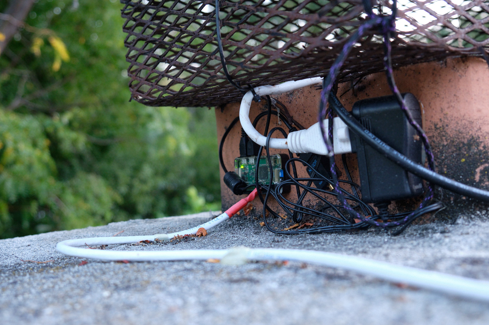

Living in California, we must face a fire season every year that keeps getting worse. While I am in no danger of getting torched thankfully, the air quality always takes a significant dip around this time of year.

After seeing a inexpensive air quality sensor on Adafruit, I decided to make up a little weatherstation that would give live air quality, temperature, and humidity. 
While I was at it, I wanted to put in an ADS-B receiver to check out where planes are around me -- and get that sweet, sweet [Flightradar24 Business subscription](https://www.flightradar24.com/build-your-own). It also feeds to FlightAware and ADS-B Exchange.  

, and TV antenna")

The weather station (with a nice [3D printed Stevenson Screen](https://www.thingiverse.com/thing:2970799)) has a [PM2.5 air quality sensor](https://www.adafruit.com/product/3686) and a [Si7021 temperature/humidity sensor](https://www.adafruit.com/product/3251), both from Adafruit.

 and adapter on the left")

These sensors connect via a length of Cat6 cable to the [Raspberry Pi Zero W](https://www.adafruit.com/product/3400) which collects the data every two minutes. 

The Pi and the SDR aren't particularly weathersealed, but hopefully between generally gentle weather and the fact that they're both under the chimney cover, it won't be a problem. 

All the data that's collected uploads to [Adafruit IO](https://io.adafruit.com), which offers a free tier that gives up to 10 feeds, at a maximum of 30 measurements per minute. 
I'm way under that at 5 feeds and 5 measurements every 2 minutes, so that works great for me. It only keeps the data for 30 days, but this is less of a long-term scientific experiment and more of a "how's the weather right now?"

The data is also sent to HomeAssistant via MQTT, which is running on [my local server](../homelab).
This means that I can trigger automations and send alerts when the air quality gets particularly bad.

You can check out the code running on the Pi [on Github](https://github.com/eosti/weatherstation) and see the current data [on Adafruit IO](https://io.adafruit.com/eosti/dashboards/outside-weather).

